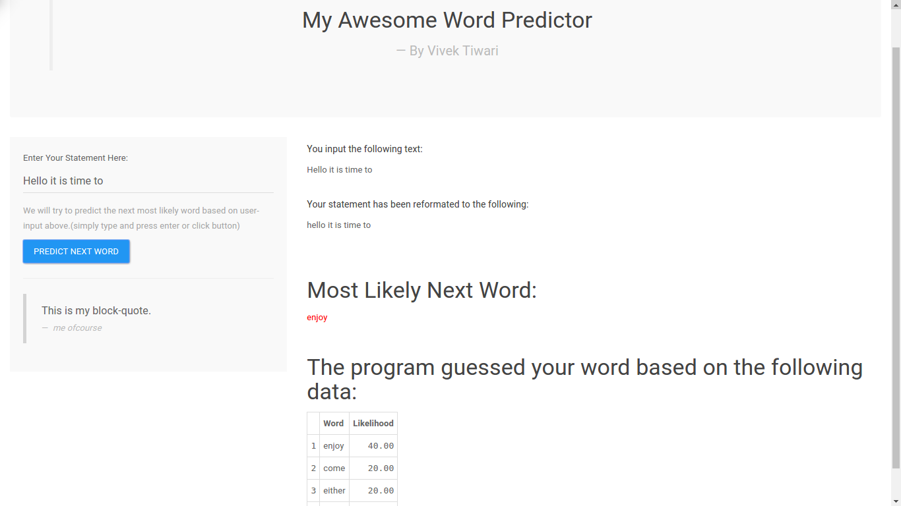

---
title       : My Awesome Word Predictor
subtitle    : Data Science Capstone Project-2016
author      : Vivek Tiwari
job         : 
framework   : io2012        # {io2012, html5slides, shower, dzslides, ...}
highlighter : highlight.js  # {highlight.js, prettify, highlight}
hitheme     : tomorrow      # 
widgets     : []            # {mathjax, quiz, bootstrap}
mode        : selfcontained # {standalone, draft}
knit        : slidify::knit2slides

--- .class #slide1 class:myCss

## What is 'My Awesome Word Predictor'?

1. This is an quick and easy text prediction application.
2. The purpose of creating an app like this is to offer advantages over standard typing methods on mobile devices.
  - Improved typing speed
  - Improved spelling and accuracy
3. The project data sponsor was SwiftKey who already have an awesome app like this on android.

--- .class #slide2 class:myCss

## The App Interface

--- .class #slide3 class:myCss

## Explaining the App Interface

1. **'My Awesome Word Predictor'** allows you to enter a custom word or phrase.

2. Once you click "Predict Next Word"(or simply press enter), **'My Awesome Word Predictor'** displays your selected input before and after processing. (usually not much change for words available except minor case difference)

3. **'My Awesome Word Predictor'** will output the most likely word in red text and a list of possible alternatives in the table below.

--- .class #slide4 class:myCss

## Working of the App Logic

1. **'My Awesome Word Predictor'** uses the [HC Corpora][1] data set determining word frequency.

2. The [HC Corpora][1] data set is screened and processed to removed extraneous characters and then is categorized into the most frequent word combinations (N-grams).

3. Using these N-gram frequencies **'My Awesome Word Predictor'** can take the user submitted sentences and quickly calculate the most likely next word.

4. The algorithm developed to predict the next word in a user-entered text string was based on a classic N-gram model.[Wiki Link][2]

[1]: http://www.corpora.heliohost.org/ "HC Corpora"
[2]: http://en.wikipedia.org/wiki/N-gram "Wiki Link"

--- .class #slide5 class:myCss

## References

- The code to the application can be found on [Github][1]

- Working Version of [MyAwesomeWordPredictor][2]

- The source [HC Corpora][3] data set and associated [ReadMe][4].

- Thanks to everyone on Coursera forums who helped out when stuck with initial data-exploration issues.

[1]: https://github.com/vivekdtiwari/capstoneSuccess "Github"
[2]: https://vivekdtiwari.shinyapps.io/MyAwesomeWordPredictor "MyAwesomeWordPredictor"
[3]: http://www.corpora.heliohost.org/ "HC Corpora"
[4]: http://www.corpora.heliohost.org/aboutcorpus.html "ReadMe"

